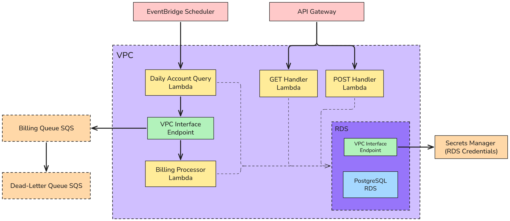

# Billing API AWS Project
This project is my first project utilising AWS, as a serverless small-scale billing API primarily utilising SQS and Lambda functions. Below is the general workflow diagram:

## General Overview
The EventBridge Scheduler runs daily, removing the need for a server, executing the lambda which queries for accounts with an associated rebilling date past or at the current date.

Those accounts are packed into a json object and pushed into an SQS queue. When the SQS queue receives a message, it triggers the billing processor lambda. This function writes into the ledger of the rebilling event, sends a signal (to a mock log message interfacing to a payment API), and resets the rebilling date for the account.

In terms of API Access, there is an API gateway with lambda handlers for GET and POST requests, allowing the following features:
- Getting the current state of an account (e.g. ACTIVE, PENDING, INACTIVE)
- Getting the ledger information relevant to a given account,
- Creating a new user via POST data

## Finer Details
### VPC
All of the lambda functions and the RDS are within the VPC. Security groups are defined for access between services, such that services can only access what they directly need. For services not within the VPC, namely SQS and Secrets Manager, there are VPC Interface endpoints for access to specific services without security implications.

### RDS
The credentials for the database are stored in the Secrets Manager, thus requiring the lambda functions to access the secrets manager, as previously noted.
Regarding the actual database tables, the only one worth noting that is particularly different to the rest is the ledger, which has a trigger to prevent `UPDATE` or `DELETE` statements, thus emulating an append-only effect.
For the message design, there are idempotency keys such that users can't be rebilled twice if the function mistakenly triggers twice, or the SQS message is partially processed before suddenly terminating.

### Cloudwatch
Not pictured, but part of the terraform configuration is a cloudwatch dashboard that tracks the metrics for SQS - essentially the number of messages stored in both the standard queue and the DLQ. The dashboard also tracks the logs for each lambda execution at an ERROR level or higher.

### Terraform
The terraform configs were made after the project was finished, using the import blocks and manually adjusting the fields.